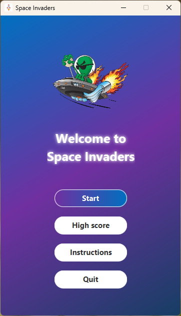
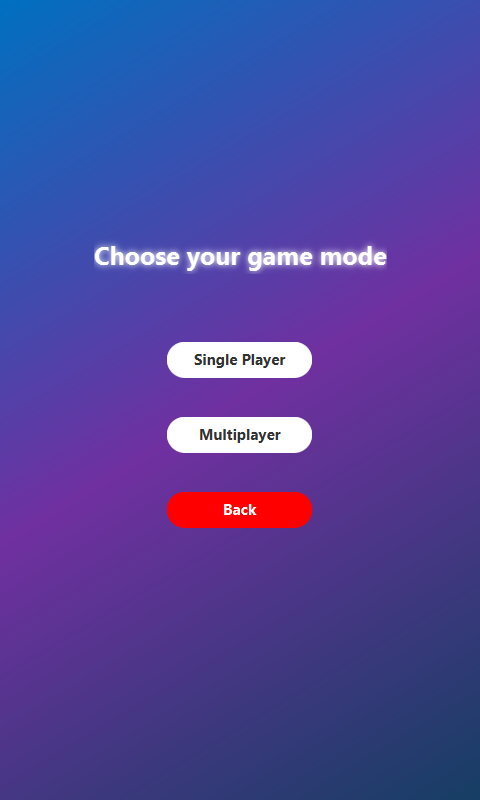
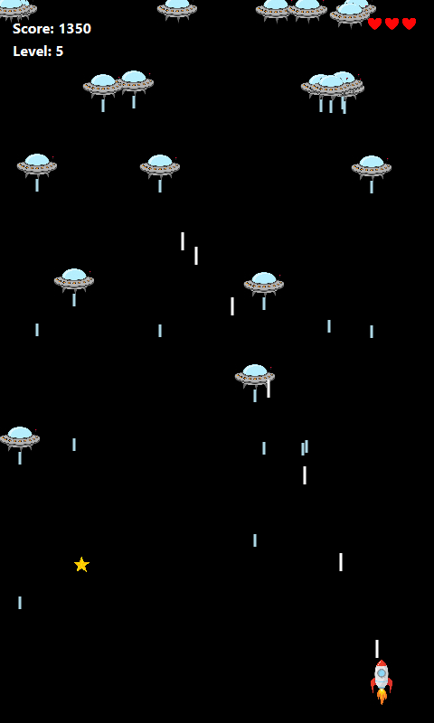
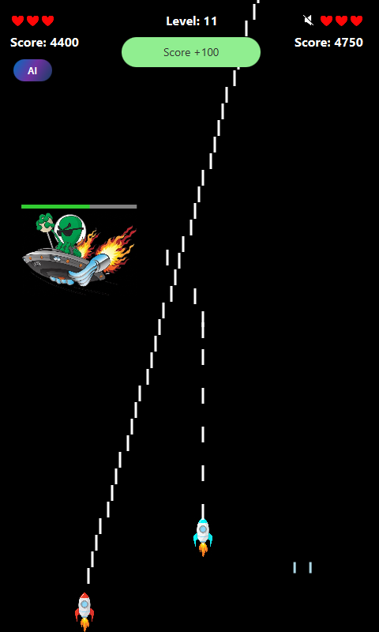
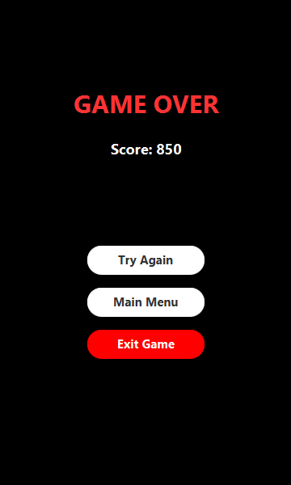
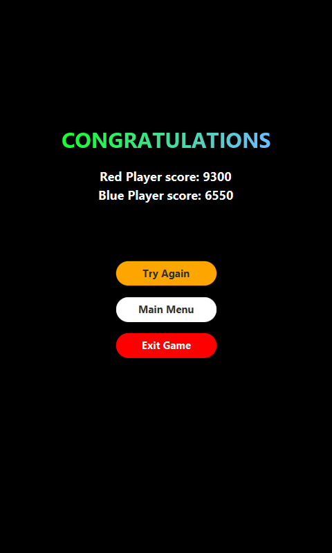
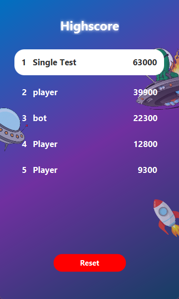

## 💁 Introduction
- Space Shooter is a lightweight 2D game built with JavaFX. Pilot your spaceship, dodge enemy fire, collect power-ups, and defeat waves of enemies—including challenging boss encounters—as you aim for the highest score.

## 🧑‍💻 Members
- 24022248 - Hoàng Hải Anh.
- 24022272 - Nguyễn Hoàng Công.
- 24022278 - Tạ Mạnh Cường.

## 📐 Rules
- Avoid enemies **reaching the bottom** of the screen or **colliding with your ship**.
- You have only **three** chances of colliding with a bullet. After that, it's game over.
- Collect power-ups to boost firepower, increase score and keep health bar full.
- The game ends when **all lives are lost**, but you can start over by resetting the game.

## 🎮 Controls
### Player 1 / Player in Singleplayer mode
* Use `W` `A` `S` `D` to move the spaceship.
- Press `SPACE` to shoot at enemies.

### Player 2
* Use `↑` `←` `↓` `→` to move the spaceship. 
- Press `ENTER` to shoot at enemies.

### General
- Press `P` to enable AI mode.
* Press `ESC` to pause the game.
- Press `M` to mute audio.

## 🖼️ Screenshots

### Start Screen

    

### Game Mode Screen

    

### Gameplay
<table align="center">
  <tr>
    <td align="center">
       
      <em>Single Player Mode</em>
    </td>
    <td align="center" style="padding-left: 20px;">
       
      <em>Multiplayer Mode</em>
    </td>
  </tr>
</table>

### Losing Screen

    

### Victory Screen

    

### Scoreboard

    

## 💻 Requirements
- JDK 17 or higher.
- A display with a minimum resolution of 800x480 pixels.
- JavaFX SDK version compatible with your installed JDK.
