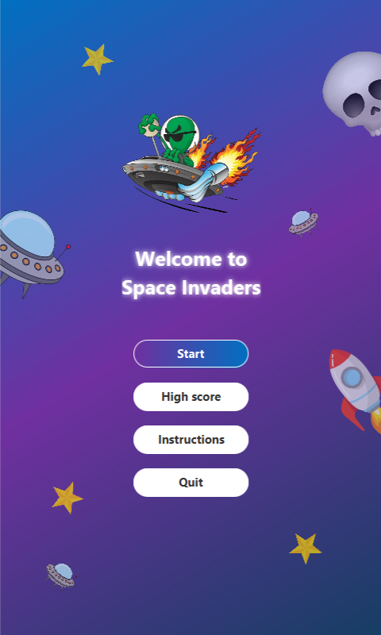

## Introduction
- Space Shooter is a lightweight 2D game built with JavaFX. Pilot your spaceship, dodge enemy fire, collect power-ups, and defeat waves of enemies—including challenging boss encounters—as you aim for the highest score.

## Members
- 24022248 - Hoàng Hải Anh.
- 24022272 - Nguyễn Hoàng Công.
- 24022278 - Tạ Mạnh Cường.

## How to Play
- Use the A, W, S, D keys or arrow keys to move the spaceship.
- Press SPACE to shoot at enemies.
- Avoid letting enemies reach the bottom of the screen or colliding with them.
- You have only 3 chances of colliding with a bullet. After that, it's game over.
- Collect power-ups to enhance your capabilities and increase your score.
- The game ends when all lives are lost, but you can start over by resetting the game.

## Screenshots
### Start Screen

    

### Gameplay

    

### Instructions

    

### Losing Screen

    

### Scoreboard

## Requirements
- JDK 24 or higher.
- JavaFX SDK (version compatible with your JDK).
- Internet connection (for scoreboard and multiplayers).